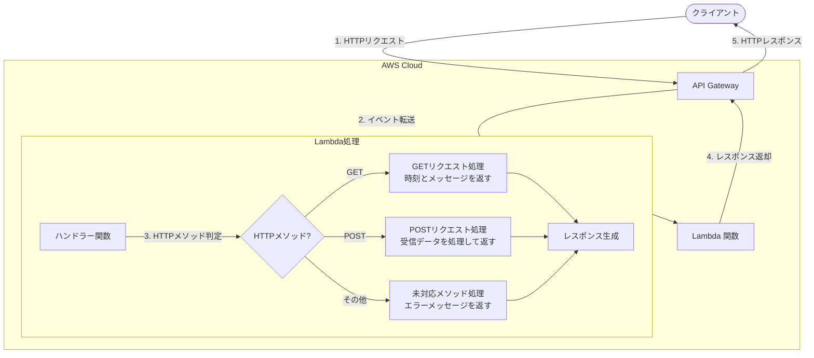
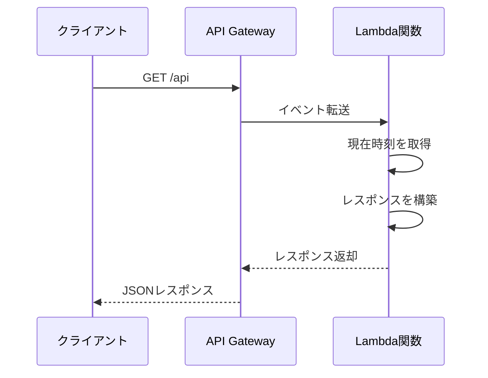
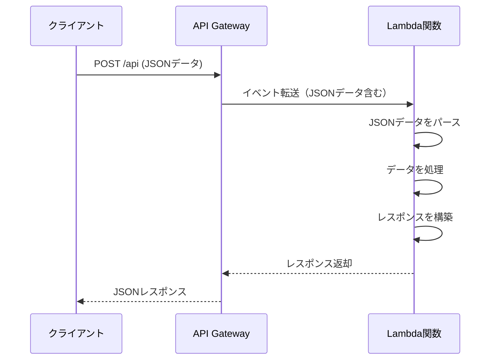

# API Gateway Lambda プロジェクトドキュメント

このドキュメントでは、API Gateway と Lambda を使用した REST API の構成、業務フロー、および API エンドポイントの追加方法について説明します。

## 目次

1. [システム概要](#システム概要)
2. [業務フロー](#業務フロー)
3. [API エンドポイントの追加方法](#api-エンドポイントの追加方法)
4. [テスト方法](#テスト方法)

## システム概要

このシステムは AWS CDK を使用して、Amazon API Gateway と AWS Lambda による REST API を構築しています。現在、以下の機能を提供しています：

- `/api` エンドポイントへの GET リクエスト：現在の時刻とメッセージを返す
- `/api` エンドポイントへの POST リクエスト：送信されたデータを受け取り、確認メッセージを返す

## 業務フロー

以下の図は、API リクエストの処理フローを示しています：



### GET リクエスト処理フロー



### POST リクエスト処理フロー



## API エンドポイントの追加方法

新しい API エンドポイントを追加するには、以下の手順に従ってください：

### 1. CDK スタックの更新

`api_gateway_lambda_stack.py` ファイルを編集して、新しいリソースとメソッドを追加します：

```python
# 新しいリソース（エンドポイント）を追加
new_resource = api.root.add_resource("new-endpoint")

# リソースに対してHTTPメソッドを追加
new_resource.add_method("GET", lambda_integration)
new_resource.add_method("POST", lambda_integration)
```

### 2. Lambda ハンドラーの更新

`lambda/api_handler.py` ファイルを編集して、新しいエンドポイントのロジックを追加します：

```python
def handler(event, context):
    # 既存のコード...
    
    http_method = event.get('httpMethod', '')
    path = event.get('path', '')
    
    # 現在の時刻を取得
    current_time = datetime.datetime.now().isoformat()
    
    # パスに基づいて処理を分岐
    if path == '/api':
        if http_method == 'GET':
            # 既存のGET処理...
        elif http_method == 'POST':
            # 既存のPOST処理...
    elif path == '/new-endpoint':
        if http_method == 'GET':
            response_body = {
                'message': 'This is the new endpoint!',
                'timestamp': current_time
            }
        elif http_method == 'POST':
            # 新しいPOST処理...
    else:
        response_body = {
            'message': f'Unsupported path: {path}',
            'timestamp': current_time
        }
    
    # レスポンスを返す...
```

### 3. テストの追加

`tests/unit/test_lambda_handler.py` ファイルを更新して、新しいエンドポイントのテストを追加します：

```python
def test_new_endpoint_get():
    # 新しいエンドポイントのGETリクエストをテスト
    event = {
        'httpMethod': 'GET',
        'path': '/new-endpoint',
        'headers': {},
        'queryStringParameters': None,
        'body': None
    }
    
    response = handler(event, None)
    
    assert response['statusCode'] == 200
    body = json.loads(response['body'])
    assert 'message' in body
    assert body['message'] == 'This is the new endpoint!'
```

### 4. デプロイ

変更をデプロイするには：

```bash
cdk deploy
```

## テスト方法

新しいエンドポイントをテストするには：

### ローカルテスト

```bash
pytest
```

### デプロイ後のテスト

```bash
# GET リクエスト
curl https://your-api-id.execute-api.region.amazonaws.com/prod/new-endpoint

# POST リクエスト
curl -X POST \
  https://your-api-id.execute-api.region.amazonaws.com/prod/new-endpoint \
  -H 'Content-Type: application/json' \
  -d '{"name": "Test User", "message": "Testing new endpoint"}'
```